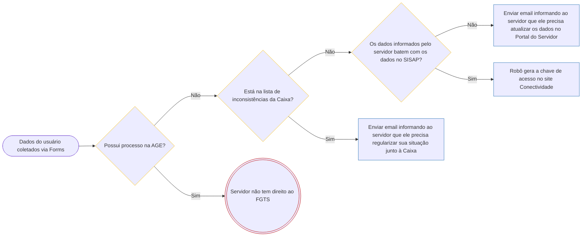

```mermaid
flowchart LR
    1(["Dados do usuário coletados via Forms"]) --> 2{"Possui processo na AGE?"}
    2 -- Sim ---> 2.1((("Servidor não tem direito ao FGTS")))
    2 -- Não ---> 3{"Está na lista de inconsistências da Caixa?"}
    3 -- Sim ---> 3.1["Enviar email informando ao servidor que ele precisa regularizar sua situação junto à Caixa"]
    3 -- Não ---> 4{"Os dados informados pelo servidor batem com os dados no SISAP?"}
    4 -- Não ---> 4.1["Enviar email informando ao servidor que ele precisa atualizar os dados no Portal do Servidor"]
    4 -- Sim ---> 5["Robô gera a chave de acesso no site Conectividade"]
    style 2.1 stroke:#C00000
    style 2 stroke:#ffc000
    style 3 stroke:#ffc000
    style 4 stroke:#ffc000
    style 3.1 stroke:#2e75b6
    style 4.1 stroke:#2e75b6
    style 5 stroke:#2e75b6;

```
